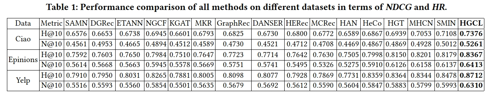

# 
简介
异质图对比学习推荐系统 (HGCL) 通过异质图对比学习推进推荐系统。HGCL 将元网络与对比学习结合，用于自适应增强，从而实现用户特定和物品特定的知识转移。它通过定制的跨视图增强来改进图对比学习。

环境
HGCL 的代码在以下开发环境中实现和测试： pyTorch: Python=3.7.10 Torch=1.8.1 Numpy=1.20.3 Scipy=1.6.2

数据集
我们利用了三个数据集来评估 HGCL：Yelp，Epinions 和 CiaoDVD。按照隐式反馈的常规设置，如果用户 u_i 评分了物品 v_j，那么元素 (u_i, v_j) 被设置为 1，否则为 0。我们过滤掉了交互太少的用户和物品。数据集按 1: (n-1) 划分为训练集和测试集。

代码的运行
先解压数据集，创建 History/ 和 Models/ 目录。以下是训练 Yelp/Epinions/CiaoDVD 数据集上 HGCL 的命令。这些命令指定了生成论文中报告结果的超参数的设置。
python main.py --dataset Yelp --ssl_temp 0.5 --ssl_ureg 0.06 --ssl_ireg 0.07 --lr 0.058 --reg 0.05 --ssl_beta 0.45 --rank 3
python main.py --dataset Epinions --ssl_temp 0.5 --ssl_ureg 0.04 --ssl_ireg 0.05 --lr 0.055 --reg 0.043 --ssl_beta 0.32 --rank 3
python main.py --dataset CiaoDVD --ssl_temp 0.6 --ssl_ureg 0.04 --ssl_ireg 0.05 --lr 0.055 --reg 0.065 --ssl_beta 0.3 --rank 3

实验结果
不同数据集中所有方法在 NDCG 和 HR 指标上的性能比较： 
    

